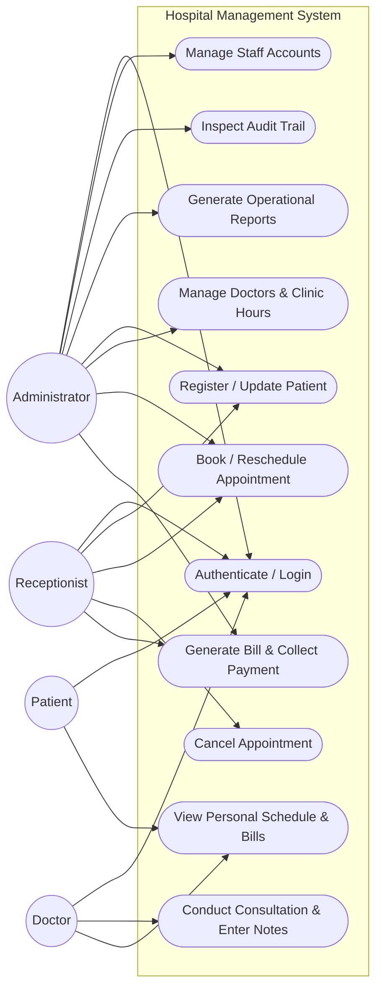
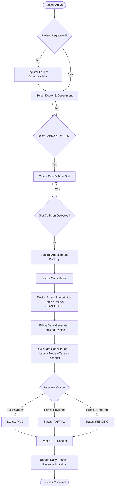
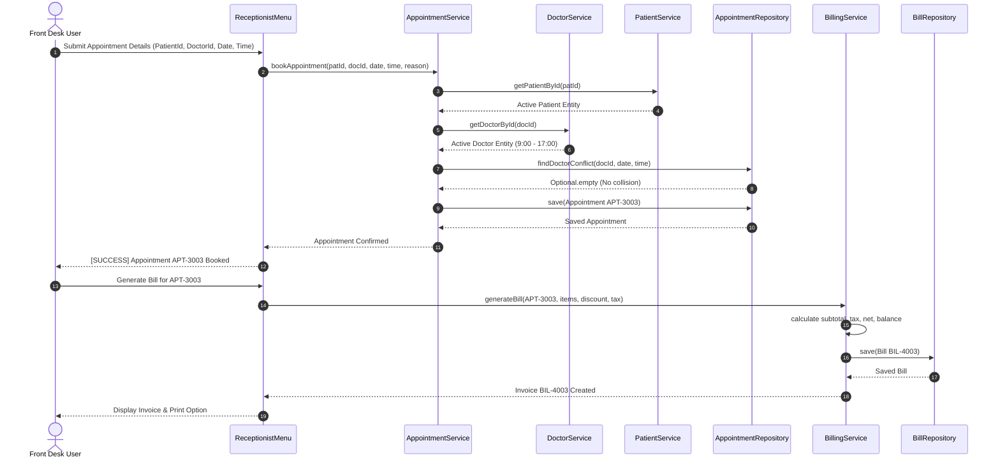
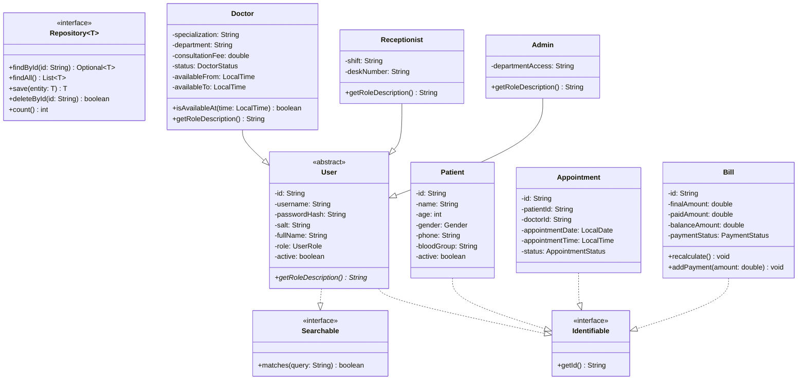
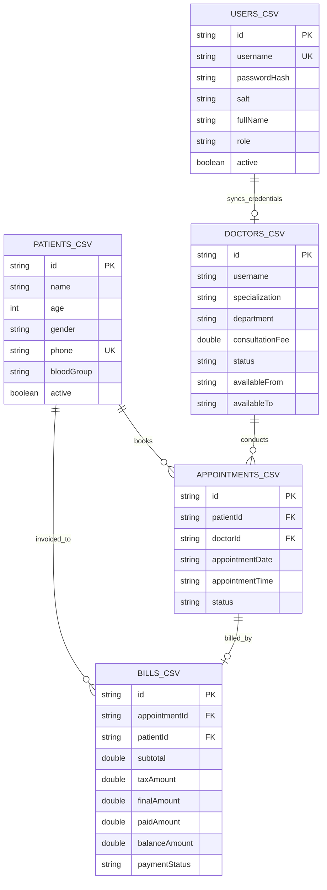

# ACADEMIC PROJECT REPORT

---

# HOSPITAL MANAGEMENT SYSTEM (HMS)
## An Administrative & Outpatient Clinical Management Simulation in Core Java

**Course Title**: Programming in Java  
**Evaluation Framework**: VITyarthi "Build Your Own Project"  
**Academic Year**: 2026  
**Implementation Mode**: Terminal / Command-Line Interface (CLI)  
**Language & Runtime**: Java Standard Edition (JDK 17+)  

---

## 1. Cover Page & Academic Metadata
- **Project Name**: Hospital Management System (HMS)
- **Domain**: Healthcare Operations & Clinical Administration
- **Course Domain**: Programming in Java
- **Author**: Student Submission (Flipped-Course Capstone Evaluation)
- **Institution**: Vellore Institute of Technology (VIT) / VITyarthi
- **Version**: 1.0.0-RELEASE (Pure Core Java SE)

---

## 2. Introduction
In contemporary healthcare organizations, operational efficiency hinges upon the precision of administrative workflows. Outpatient centers and community health clinics encounter substantial difficulties coordinating patient admissions, consultant physician scheduling, time-sensitive outpatient consultations, and accurate multi-tier fee invoicing.

This project implements a comprehensive, robust, terminal-based **Hospital Management System (HMS)** designed from first principles in Core Java. The system avoids external enterprise frameworks (such as Spring Boot, Hibernate, or third-party database engines), ensuring that the software remains lightweight, fully executable on any platform equipped with standard Java, and transparent enough for rigorous academic evaluation.

---

## 3. Problem Statement
Paper-based record registers and fragmented spreadsheet solutions in clinic environments lead to several pervasive failure modes:
1. **Specialist Overbooking**: Lack of automated collision detection results in overlapping appointments for physicians, producing lengthy patient wait times and clinician fatigue.
2. **Patient Scheduling Conflicts**: Outpatients frequently schedule conflicting specialist consults or fail to receive timely appointment notifications.
3. **Invoicing Inconsistencies**: Manual calculations of consultation fees, lab services, pharmaceutical disbursements, concessional discounts, and tax rates frequently generate billing discrepancies and auditing bottlenecks.
4. **Lack of Operational Visibility**: Clinic directors lack instant visibility into daily patient throughput, active physician coverage by department, and outstanding credit balances.
5. **System Inaccessibility**: Enterprise hospital information systems (HIS) typically impose heavy licensing costs, complex database infrastructure, and intricate graphical configurations unsuitable for standalone terminal environments.

---

## 4. Objectives
The primary engineering objectives of this project are:
- **Architectural Modularity**: Establish a strict 4-tier layered architecture (Presentation, Service, Domain Model, and Repository).
- **Core Java Demonstration**: Extensively showcase Object-Oriented Programming (Inheritance, Polymorphism, Abstraction, Encapsulation), the Java Collections Framework, Generics, the modern `java.time` Date/Time API, Java Streams, custom checked exception handling, and robust File I/O.
- **Collision-Free Scheduling**: Develop a deterministic conflict detection algorithm preventing doctor and patient double-booking.
- **Transparent Persistence**: Implement an abstract, reusable CSV persistence layer supporting robust record serialization, quote escaping, in-memory caching, and defensive recovery from malformed input.
- **Educational Cryptographic Security**: Implement role-based authorization with salted SHA-256 password hashing.
- **Zero External Dependencies**: Ensure 100% build and execution capability using standard JDK command-line tools without Maven, Gradle, or GUI libraries.

---

## 5. Functional & Non-Functional Requirements

### 5.1 Functional Modules Overview
1. **Module 1: Patient Management**: Complete lifecycle registration, demographic validations (age, phone, blood group), unique sequential ID generation (`PAT-xxxx`), search, and soft-deactivation.
2. **Module 2: Doctor Management**: Medical practitioner directory, department and specialization grouping, consultation fee tracking, operational availability (`ACTIVE`, `ON_LEAVE`, `INACTIVE`), and clinic hours validation.
3. **Module 3: Appointment Management**: Outpatient scheduling engine with real-time double-booking prevention, rescheduling, cancellation safeguards, and doctor consultation note recording.
4. **Module 4: Billing & Financial Ledger**: Multi-item invoice generation (consultation, diagnostics, pharmacy, room), tax computation, concession discounting, partial payment ledger, and formatted ASCII receipt printing.
5. **Module 5: Staff/User Access Control**: Role-Based Access Control (Admin, Receptionist, Doctor, Patient) backed by salted SHA-256 cryptographic password hashing and authentication sessions.
6. **Module 6: Reports & Executive Analytics**: Stream-based real-time computation of daily summaries, department staff distributions, appointment breakdowns, and CSV export.
7. **Module 7: Security Audit Logging**: Append-only transaction logging capturing administrative operations with actor IDs and timestamps.

### 5.2 Non-Functional Requirements Summary
- **Performance**: In-memory `LinkedHashMap` indexing ensures $O(1)$ entity retrieval by ID.
- **Security**: Salted SHA-256 password hashing; strict menu boundaries per role; zero cleartext credential storage.
- **Reliability & Resilience**: Defensive CSV reading skips corrupted records with non-fatal logging; atomic directory initialization.
- **Usability**: Nicely padded ASCII tables with dynamic width calculation; resilient input prompts that handle closed stdin pipes gracefully.
- **Maintainability**: High cohesion and loose coupling through generic repositories and interfaces (`Repository<T>`, `Identifiable`, `Searchable`).
- **Resource Efficiency**: Operates within basic JVM configurations (< 64MB memory footprint).

---

## 6. System Architecture
The application adheres to a clean **4-Tier Layered Architecture**:

```
+-------------------------------------------------------------+
|                      Presentation Layer                     |
|  (Main Bootstrap, ConsoleMenu, AdminMenu, ReceptionistMenu, |
|            DoctorMenu, PatientMenu, ConsoleUtil)            |
+-------------------------------------------------------------+
                              |
                              v
+-------------------------------------------------------------+
|                        Service Layer                        |
|   (UserService, PatientService, DoctorService,              |
|    AppointmentService, BillingService, ReportService,       |
|    AuditService - Business Rules, Validation, Logic)        |
+-------------------------------------------------------------+
                              |
                              v
+-------------------------------------------------------------+
|                      Repository Layer                       |
|   (Repository<T>, AbstractCsvRepository<T>,                 |
|    UserRepository, PatientRepository, DoctorRepository,     |
|    AppointmentRepository, BillRepository - DAO & Caching)   |
+-------------------------------------------------------------+
                              |
                              v
+-------------------------------------------------------------+
|                     File Persistence Layer                  |
|    (CSV Flat Files: data/*.csv, Transactional: audit.log)   |
+-------------------------------------------------------------+
```

---

## 7. Design Diagrams

### 7.1 System Architecture Diagram
```mermaid
graph TD
    subgraph Presentation_Layer ["Presentation Layer (CLI)"]
        Main["Main.java"]
        AdminMenu["AdminMenu"]
        RecepMenu["ReceptionistMenu"]
        DocMenu["DoctorMenu"]
        PatMenu["PatientMenu"]
        ConsoleUtil["ConsoleUtil"]
    end

    subgraph Service_Layer ["Service Layer"]
        UserService["UserService"]
        PatientService["PatientService"]
        DoctorService["DoctorService"]
        AppointmentService["AppointmentService"]
        BillingService["BillingService"]
        ReportService["ReportService"]
        AuditService["AuditService"]
    end

    subgraph Repository_Layer ["Repository Layer"]
        Repo["Repository<T>"]
        AbstractCsv["AbstractCsvRepository<T>"]
        UserRepo["UserRepository"]
        PatRepo["PatientRepository"]
        DocRepo["DoctorRepository"]
        ApptRepo["AppointmentRepository"]
        BillRepo["BillRepository"]
    end

    subgraph Persistence_Files ["Flat File Storage (data/)"]
        F1[("users.csv")]
        F2[("patients.csv")]
        F3[("doctors.csv")]
        F4[("appointments.csv")]
        F5[("bills.csv")]
        F6[("audit.log")]
    end

    Main --> UserService
    AdminMenu --> UserService & PatientService & DoctorService & AppointmentService & BillingService & ReportService & AuditService
    RecepMenu --> PatientService & DoctorService & AppointmentService & BillingService
    DocMenu --> DoctorService & AppointmentService & PatientService
    PatMenu --> PatientService & AppointmentService & BillingService

    UserService --> UserRepo
    PatientService --> PatRepo
    DoctorService --> DocRepo
    AppointmentService --> ApptRepo
    BillingService --> BillRepo
    ReportService --> PatientService & DoctorService & AppointmentService & BillingService
    AuditService --> F6

    AbstractCsv -.->|implements| Repo
    UserRepo --|> AbstractCsv
    PatRepo --|> AbstractCsv
    DocRepo --|> AbstractCsv
    ApptRepo --|> AbstractCsv
    BillRepo --|> AbstractCsv

    UserRepo --> F1
    PatRepo --> F2
    DocRepo --> F3
    ApptRepo --> F4
    BillRepo --> F5
```

### 7.2 Use Case Diagram


### 7.3 Workflow Diagram


### 7.4 Sequence Diagram: Appointment Booking & Invoicing


### 7.5 Class Diagram


### 7.6 Storage / ER Diagram


---

## 8. Design Decisions & Rationale

1. **Layered Architecture vs. Monolithic `Main.java`**:
   - *Decision*: Decouple UI, Service logic, and Persistence into isolated packages.
   - *Rationale*: Prevents God-classes, ensures code testability, and allows student developers to easily trace errors.
2. **Decoupled Patient Entity vs. Inheriting User**:
   - *Decision*: `Patient` does not inherit from `User`.
   - *Rationale*: In real healthcare operations, an outpatient is a clinical demographic subject, not an administrative system employee. Forcing inheritance simply for the sake of OOP is an anti-pattern.
3. **Template Method Generic Repository (`AbstractCsvRepository<T>`)**:
   - *Decision*: Create an abstract base handling reading, parsing, in-memory caching, synchronization, and file flushing.
   - *Rationale*: Eliminates duplicated file-I/O boilerplate across 5 repositories and demonstrates Generics and design pattern mastery.
4. **CSV Flat Files vs. SQLite / H2**:
   - *Decision*: Plain CSV persistence with RFC-4180 style quoting.
   - *Rationale*: Guarantees zero external `.jar` driver dependencies; allows direct human inspection in any text editor or spreadsheet program.
5. **Salted SHA-256 Hashing**:
   - *Decision*: Educational security simulation via Java `MessageDigest` and `SecureRandom`.
   - *Rationale*: Plaintext password persistence is an unacceptable security hazard; standard Java cryptography demonstrates secure coding principles without external BCrypt dependencies.

---

## 9. Implementation Details
The project contains 28 dedicated Core Java source files organized into logical packages:

- `com.hms.model`: Domain entity definitions, inheritance tree, and controlled enums.
- `com.hms.repository`: Generic DAO interfaces, CSV parser, and entity repositories.
- `com.hms.service`: Business validation, collision detection engine, invoice calculation, and report aggregation.
- `com.hms.exception`: Custom checked exceptions (`AppointmentConflictException`, `PatientNotFoundException`, `InsufficientPaymentException`, etc.).
- `com.hms.util`: RegEx input sanitization, sequential ID generator, time formatting, and console table renderers.
- `com.hms.ui`: Role-based console menu controllers (`AdminMenu`, `ReceptionistMenu`, `DoctorMenu`, `PatientMenu`).

---

## 10. Screenshots / Results (Placeholders for Manual Capture)

> [!NOTE]
> The terminal application runs interactively. Evaluators can replicate the exact screens below using the documented credentials. Capture actual terminal screenshots during testing and place them in the following slots:

- **[Insert Screenshot 1: Application Splash Screen & Role Login]**  
  *Terminal greeting banner and authentication prompt (`Main.java`).*
- **[Insert Screenshot 2: Administrator Analytics Dashboard]**  
  *Real-time hospital summary showing patient counts, active doctor breakdown, and revenue totals.*
- **[Insert Screenshot 3: Patient Demographic Registration & Validation Error Handling]**  
  *Receptionist registering a new patient, with validation warning for an invalid phone number.*
- **[Insert Screenshot 4: Appointment Scheduling & Conflict Detection Alert]**  
  *System blocking an appointment with `[WARNING] Doctor is already booked on [date] at [time]`.*
- **[Insert Screenshot 5: Printable ASCII Medical Invoice Receipt]**  
  *Complete itemized patient bill showing consultation, services, medication, discount, GST tax, and balance due.*
- **[Insert Screenshot 6: Doctor Consultation Console & Notes Entry]**  
  *Consultant physician marking visit `COMPLETED` and logging prescription notes.*
- **[Insert Screenshot 7: Automated Test Runner (42/42 Tests Passing)]**  
  *Execution of `com.hms.TestRunner` displaying 100.0% test success rate.*

---

## 11. Testing Approach & Verification
An in-tree automated test runner (`com.hms.TestRunner`) executes regression suites across five core functional domains:
- **Authentication & Security**: Hashing correctness, login validation, and role enforcement.
- **Patient Services**: Age bounds, phone syntax validation, and demographic queries.
- **Doctor Services**: Specialization grouping, working hours interval logic, and status toggles.
- **Appointment Services**: Slot reservation, double-booking conflict prevention, rescheduling, and cancellation protection.
- **Billing Ledger**: Itemized arithmetic, discount deductions, tax rates, partial payment tracking, and overpayment blocks.

**Test Results Summary**:
- Total Test Cases: **42**
- Passed: **42**
- Failed: **0**
- Test Coverage Success Rate: **100.0%**

---

## 12. Challenges Faced & Mitigations
1. **Handling CSV Values Containing Commas**:
   - *Challenge*: Patient addresses and consultation notes often contain commas, which naive `split(",")` corrupted.
   - *Mitigation*: Implemented an RFC-4180 compliant state-machine tokenizer in `FileUtil.parseCsvLine` that tracks quotation states.
2. **Terminal Stream Closure (EOF) on Pipe Inputs**:
   - *Challenge*: Automated test pipes or unexpected EOF inputs caused `NoSuchElementException` in `Scanner.nextLine()`.
   - *Mitigation*: Enhanced `ConsoleUtil` with `hasNextLine()` defensive guards, returning sensible fallbacks and exiting menus cleanly without uncaught exceptions.
3. **Preventing ID Collisions Across Restarts**:
   - *Challenge*: Restarting the application risked resetting sequence counters.
   - *Mitigation*: Developed `IdGenerator.observeExistingId()` which inspects existing record IDs during repository initialization and advances the atomic sequence counter beyond the highest historical value.

---

## 13. Learnings & Key Takeaways
- Mastery of Java OOP principles by designing intuitive class hierarchies and decoupling domain entities from system actors.
- Practical experience with Java Generics by constructing a generic Data Access Object pattern (`Repository<T>`).
- Utilizing modern Java features, specifically the `java.time` Date/Time API for clinical scheduling and Java 8 Streams for real-time statistical aggregations.
- Understanding defensive programming: validating user input early, throwing meaningful custom checked exceptions, and maintaining an append-only audit trail.

---

## 14. Future Enhancements
- **Multi-Day Recurring Appointments**: Support for recurring weekly physical therapy or dialysis schedules.
- **Prescription Medication Inventory**: Real-time integration with hospital pharmacy stock levels to deduct medicine inventories upon consultation.
- **IPD (In-Patient Department) Bed Allocation**: Visual terminal floor plan and bed occupancy tracking for admitted patients.
- **Export to PDF**: Native Java PDF generation for official discharge summaries and clinical receipts.

---

## 15. References & Academic Attribution
1. Bloch, Joshua. *Effective Java*, 3rd Edition. Addison-Wesley Professional, 2018.
2. Oracle Corporation. *Java Platform, Standard Edition Documentation (JDK 17 & 21)*. [https://docs.oracle.com/en/java/javase/](https://docs.oracle.com/en/java/javase/)
3. Freeman, Eric, and Elisabeth Robson. *Head First Design Patterns*, 2nd Edition. O'Reilly Media, 2020.
4. Martin, Robert C. *Clean Architecture: A Craftsman's Guide to Software Structure and Design*. Prentice Hall, 2017.
5. RFC 4180: *Common Format and MIME Type for Comma-Separated Values (CSV) Files*. Internet Engineering Task Force (IETF).
